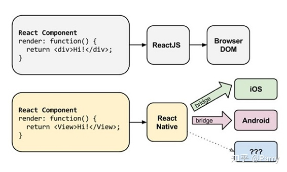
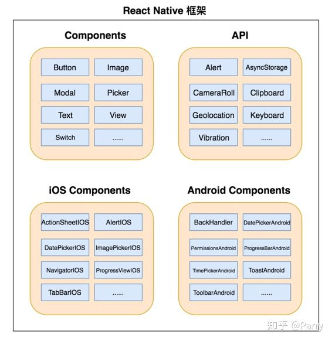
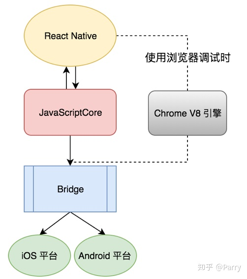

# React Native框架原理
React Native 是一个使用React和应用平台的原生功能来构建 Android 和 iOS 应用的开源框架。通过 React Native，您可以使用 JavaScript 来访问移动平台的 API，以及使用 React 组件来描述 UI 的外观和行为：一系列可重用、可嵌套的代码。

## 视图（Views）与移动开发
在 Android 和 iOS 开发中，一个视图是 UI 的基本组成部分：屏幕上的一个小矩形元素、可用于显示文本、图像或响应用户输入。甚至应用程序最小的视觉元素（例如一行文本或一个按钮）也都是各种视图。某些类型的视图可以包含其他视图。全部都是视图。

## React
HTML编写的Web应用中有文档对象模型DOM。DOM通过对象的形式来展现结构化文档。对于Web开发者来说，文档即HTML代码，DOM又称作HTML DOM，HTML的元素在DOM中叫节点。Web浏览器负责处理DOM的具体实现，并提供API接口以便对DOM进行遍历和修改。这样我们就能用JavaScript和CSS与DOM交互，比如查找节点并修改内容、移除节点、插入新节点。无论何时想要动态改变网页内容，只要通过API接口修改DOM即可（如今的DOM API几乎实现了跨平台和跨浏览器的兼容性）。
  
React的开发者采取了虚拟DOM的做法，虚拟DOM更加轻量，对真实DOM进行了抽象化，而且独立于特定浏览器的具体实现。每当触发需要改变DOM的事件时，React会创建一个新的虚拟DOM树，并将其与已有的树进行对比，计算出最少的DOM变化集合，把它们放入队列再全部批量执行，接着重新渲染视图。这种做法没有把重负荷操作全部加在真实DOM 上，因此比直接操作DOM快了很多。React的这种行为没有采用脏数据检查（dirty checking，持续检测模型变动），而是利用观察者模型进行变动检测，通过差分算法（diffing algorithm，http://calendar.perfplanet.com/2013/diff/）判断最少的DOM操作，因此很有效率。

## React Native
正如React用虚拟DOM产生的魔法一样，React Native通过原生宿主平台的API也实现了一样的效果。React Native应用借助宿主平台上Objective-C语言（iOS平台）或Java语言（Android平台）的UI库，渲染真正的原生UI组件，不仅限于WebView，这就解释了为何React Native能给应用带来更强的性能、更贴近原生的视觉感受以及使用体验。

React Native允许开发者通过JavaScript函数的代理，直接调用原生模块。JavaScript代码最终会打包生成一个 **main.bundle.js** 文件供 App 加载，此文件可以在 App 设备本地，也可以存放于服务器上供 App 下载更新。参见[React Native热更新方案](../hot-patch/README.md)。

从性能角度上分析，React Native把所有应用代码和业务逻辑从主线程转移到后台线程运行。它可以批量处理要原生执行的请求，等控制权转让给主线程时再异步执行。React Native会分析你的UI，将最少的数据传给主线程（又称UI线程）以便用原生组件进行渲染。

  

## React Native框架构成以及与原生交互通信
React Native 框架内部已提供了很多的内置组件，同时也提供了供编写与原生平台交互的接口。

在与原生框架通信中，如下图所示，React Native 采用了 JavaScriptCore 作为 JS VM，中间通过 JSON 文件与 Bridge 进行通信。而如果在使用 Chrome 浏览器进行调试时，那么所有的 JavaScript 代码都将运行在 Chrome 的 V8 引擎中，与原生代码通过 WebSocket 进行通信。

---
## 参考
- [知乎《React Native 底层原理》](https://zhuanlan.zhihu.com/p/41920417)

